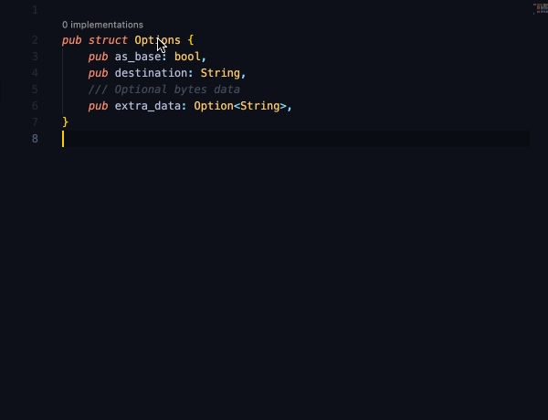

# ts-macro

`ts-macro` is a Rust procedural macro crate designed to generate TypeScript
interface bindings for Rust structs. This crate simplifies the process of
creating seamless TypeScript bindings for Rust code, making it easier to work
with WebAssembly and JavaScript ecosystems.



## Features

- **TypeScript Interface Generation**: Automatically generates TypeScript
  interfaces for Rust structs with camelCase field names and corresponding
  TypeScript types.
- **wasm-bindgen & js-sys Support**: Designed for use with `wasm-bindgen`
  projects and supports all JavaScript standard, built-in objects via `js-sys`.
- **No Boilerplate**: Just add the `#[ts]` attribute to your struct and get
  TypeScript interfaces and field getter bindings—no manual parsing required.
- **Customizable Bindings**: Customize TypeScript field names, types, and
  optionality using attributes.
- **Nested Struct Support**: Supports nested structs by applying the `ts`
  attribute to each struct individually.
- **Extensible Interfaces**: Extend TypeScript interfaces with other interfaces
  using the `extends` argument.

## Example

```rust
#[ts]
struct Token {
    symbol: String,
    /// @default 18
    decimals: Option<u8>,
    total_supply: BigInt,
}

#[wasm_bindgen]
pub fn handle_token(token: IToken) {
    let symbol = token.symbol();
    let decimals = token.decimals().unwrap_or(18.into());
    let total_supply = token.total_supply();

    let token = token.parse();
    let token: Token = token.into();
}
```

This generates the following TypeScript interface:

```typescript
interface IToken {
  symbol: string;
  /**
   * @default 18
   */
  decimals?: number | undefined;
  totalSupply: bigint;
}
```

### Nested Structs

```rust
#[ts]
struct Order {
    account: String,
    amount: BigInt,
    token: IToken, // Binding to the `Token` struct
}
```

### Customizing Bindings

You can customize the TypeScript interface using the `ts` attribute:

```rust
#[ts]
struct Params {
    #[ts(name = "specialCASING")]
    special_casing: String,

    #[ts(type = "`0x${string}`")]
    special_format: String,

    optional_field_and_value: Option<String>,

    #[ts(optional = false)]
    optional_value: Option<String>,

    #[ts(optional = true)]
    optional_field: String,
}
```

This generates:

```typescript
interface IParams {
  specialCASING: string;
  specialFormat: `0x${string}`;
  optionalFieldAndValue?: string | undefined;
  optionalValue: string | undefined;
  optionalField?: string;
}
```

### Extending Interfaces

```rust
#[ts(name = JsToken)]
struct Token {
    symbol: String,
    decimals: Number,
    total_supply: BigInt,
}

#[ts(name = JsShareToken, extends = JsToken)]
struct ShareToken {
    price: BigInt,
}
```

This generates:

```typescript
interface JsToken {
  // ...
}
interface JsShareToken extends JsToken {
  // ...
}
```

## Similar Projects

- [`ts-rs`](https://github.com/Aleph-Alpha/ts-rs) – Generates TypeScript
  definition files from Rust structs and enums, but isn’t integrated with
  wasm-bindgen and doesn’t include bindings to parse the type from a JS value.
- [`tauri-specta`](https://docs.rs/tauri-specta/) – Solves the same problem and
  more, but is specifically for [Tauri](https://tauri.app/) app backends.
- [`tsify`](https://github.com/madonoharu/tsify) – Same idea, but is built on
  [`serde-wasm-bindgen`](https://github.com/RReverser/serde-wasm-bindgen) which
  doesn’t parse JS types, so API types are limited.
